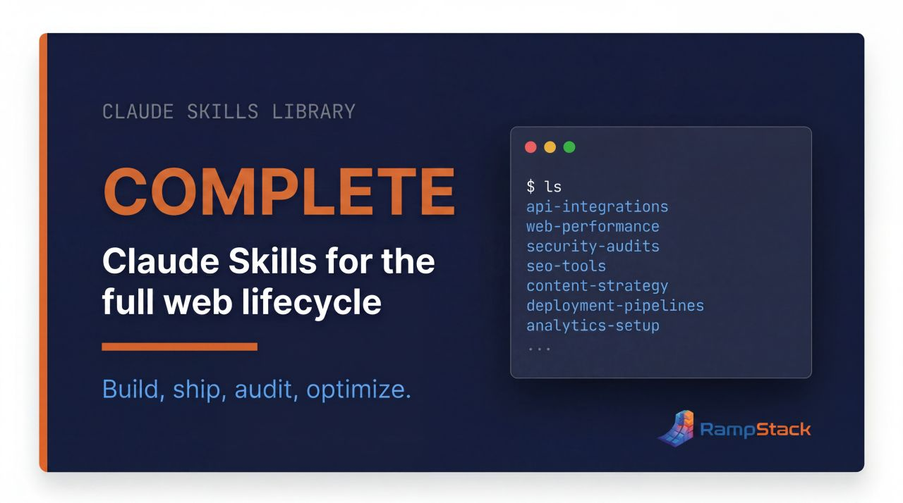
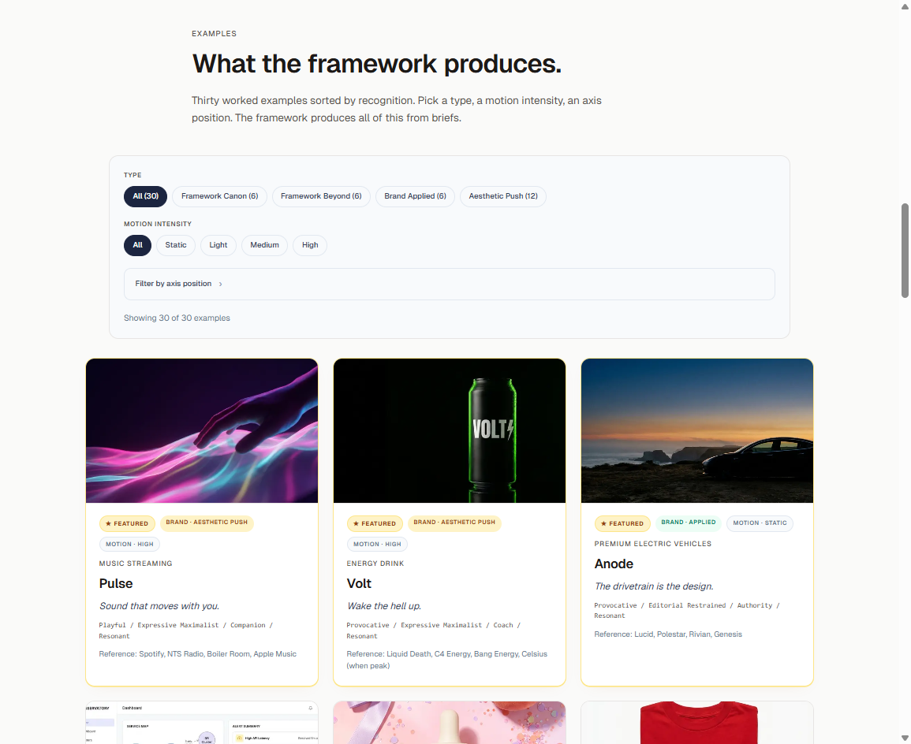
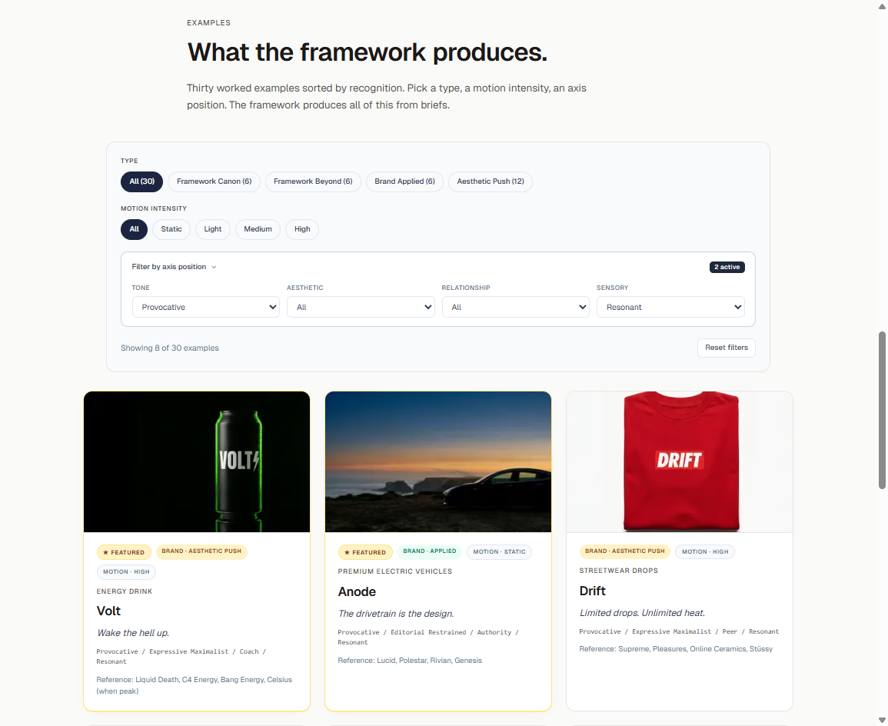
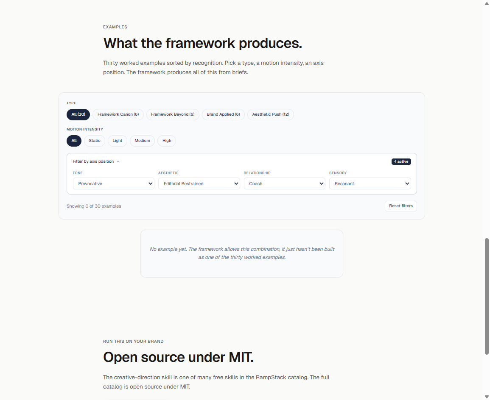
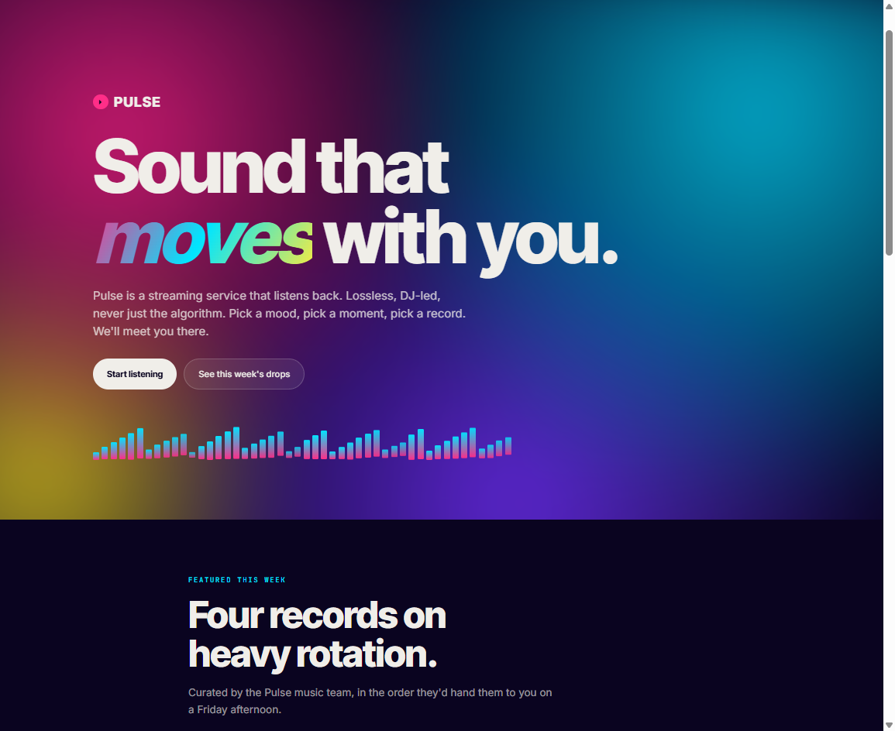
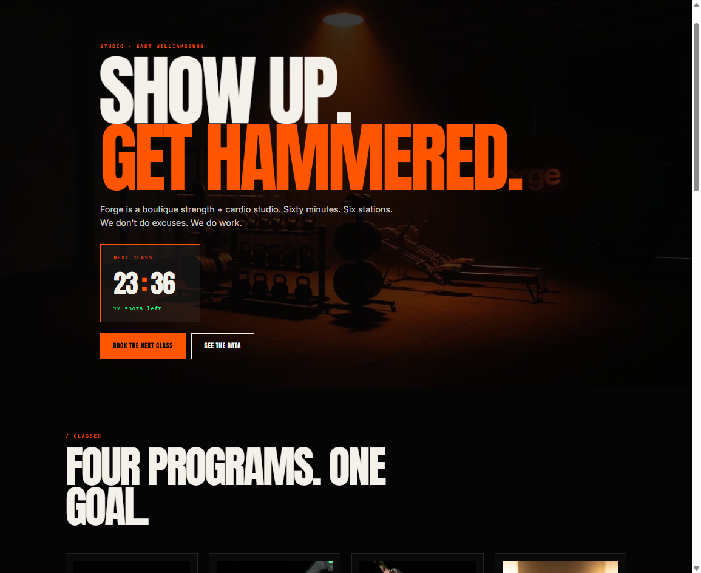
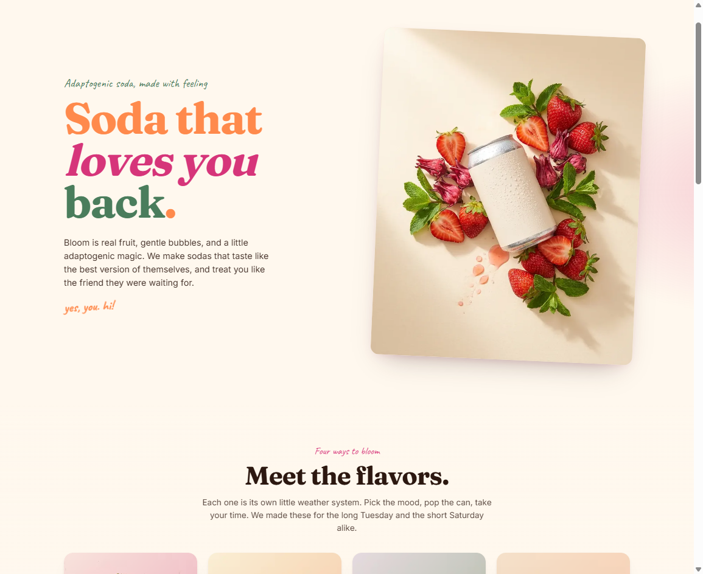
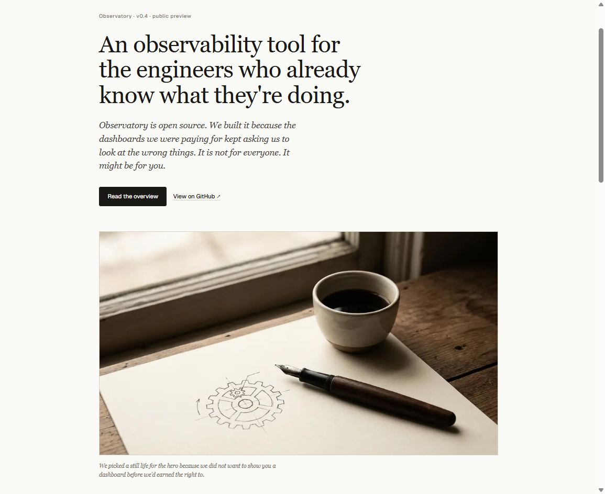
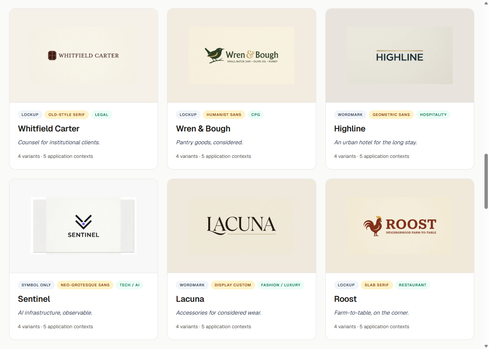

<div align="center">



# Brand Build Skills for Claude

**A complete, opinionated library of [Claude Skills](https://docs.claude.com/en/docs/agents-and-tools/agent-skills/overview) covering the full lifecycle of building, launching, running, and growing a brand and a website.**

[](LICENSE)
[](CONTRIBUTING.md)
[](#the-103-skill-catalog)
[](https://claude.ai)

[](https://rampstack.co)
[](https://linkedin.com/company/rampstack/)
[](https://x.com/RampStackco)
[](https://facebook.com/rampstack)

</div>

<!-- COUNT_INTRO:START -->
> 103 stack-agnostic skills covering brand, design, content, SEO, dev, ops, growth, and research. Includes an Ahrefs MCP-powered SEO audit suite. Use them on Next.js, WordPress, Shopify, Webflow, plain HTML, or anything else.
<!-- COUNT_INTRO:END -->

*Featured in [awesome-claude-skills](https://github.com/ComposioHQ/awesome-claude-skills) under Business & Marketing.*

---

## Install in Claude Code

Add the marketplace, then install the plugin you want:

```
/plugin marketplace add rampstackco/claude-skills

# full catalog (103 skills)
/plugin install rampstack-skills@rampstack

# focused subsets
/plugin install rampstack-starter@rampstack
/plugin install rampstack-seo@rampstack
/plugin install rampstack-pm@rampstack
```

Prefer a lighter marketplace that lists only the curated subsets (no full catalog)? Add `rampstackco/plugins` instead and install the same three plugins from there:

```
/plugin marketplace add rampstackco/plugins
/plugin install rampstack-starter@rampstack
```

Skills load on demand: each contributes roughly its name and description until Claude needs it.

---

## Table of contents

- [What are Claude Skills?](#what-are-claude-skills)
- [What is in this library](#what-is-in-this-library)
- [Featured skills](#featured-skills)
- [See it in action](#see-it-in-action)
- [Logo design in action](#logo-design-in-action)
- [Reference build in action](#reference-build-in-action)
- [Getting started](#getting-started)
- [Quick example](#quick-example)
- [How they compose](#how-they-compose)
- [How the catalog connects](#how-the-catalog-connects)
- [Surfaces](#surfaces)
<!-- COUNT_TOC:START -->
- [The 103-skill catalog](#the-103-skill-catalog)
<!-- COUNT_TOC:END -->
- [Recommended MCPs](#recommended-mcps)
- [Authoring conventions](#authoring-conventions)
- [Repository structure](#repository-structure)
- [Trust and security](#trust-and-security)
- [Contributing](#contributing)
- [Acknowledgments](#acknowledgments)
- [Resources](#resources)
- [License](#license)

---

## What are Claude Skills?

Claude Skills are reusable capability packages that teach Claude how to handle a specific kind of task with a consistent framework, vocabulary, and output format. Each skill is a folder containing a `SKILL.md` (instructions plus YAML metadata) and optional reference files (templates, checklists, worked examples). Claude loads a skill automatically when a user request matches the skill's description.

Skills work across [Claude.ai](https://claude.ai), [Claude Code](https://docs.claude.com/en/docs/claude-code/overview), and the [Anthropic API](https://docs.claude.com/en/api/agent-skills). Once you write a skill, it is portable across all three.

For the official deep dive, see [Anthropic's Agent Skills documentation](https://docs.claude.com/en/docs/agents-and-tools/agent-skills/overview).

---

## What is in this library

This is not a curated list of other people's skills. It is a single, opinionated library where every skill follows the same structure and conventions, so the skills compose cleanly across a real project lifecycle.

What you get:

<!-- COUNT_WHATYOUGET:START -->
- **103 skills** across 16 categories, every one with a complete `SKILL.md` and at least one reference file
- **448 reference files** (templates, checklists, decision matrices, worked examples)
<!-- COUNT_WHATYOUGET:END -->
- **Stack-agnostic.** Works on any web stack. The only named-tool exception is the SEO audit suite, which assumes the Ahrefs MCP.
- **Future-proof.** Principles over tools. Stable concepts over trending techniques. References to durable specs (W3C, WHATWG, Schema.org, MDN, NN/g, WCAG) over content that ages with each algorithm update.
- **Uniform structure.** Every skill uses the same section order, the same tone, and the same authoring conventions. Predictable in, predictable out.
- **Composable.** Skills reference each other. `creative-brief` points to `brand-voice`. `incident-response` points to `monitoring-and-alerting`. Each skill's "When NOT to use" tells you which sibling fits your adjacent work.

Highlight categories: brand strategy and identity, design systems, content production with full Tier 1 and Tier 2 coverage, full SEO suite (foundation plus Ahrefs MCP-powered audit suite), product management with experimentation and gap-closing tracks, growth tooling for interactive web tools, paid media discipline, frontend dev and accessibility, performance and QA, launch and incident ops, UX research, plus a meta-skill that teaches you to write your own.

---

## Featured skills

<!-- FEATURED_SKILLS:START -->
Six entry-point skills, one per audience track. Run any of these standalone, or compose them with the rest of the catalog.

| Skill | What it does |
|---|---|
| [`creative-direction`](skills/creative-direction/SKILL.md) (Brand and creative) | Four-axis brief (tone, aesthetic, audience, sensory ambition) that gives every downstream skill a coherent direction |
| [`experiment-design`](skills/experiment-design/SKILL.md) (PM, experimentation) | From hypothesis to decision: sample size, duration, segment analysis, and the failure modes that produce wrong shipping calls |
| [`feature-launch-playbook`](skills/feature-launch-playbook/SKILL.md) (PM, gap-closing) | The discipline of launching a feature well: positioning, internal alignment, customer comms, enablement, rollout, monitoring |
| [`pillar-content-architecture`](skills/pillar-content-architecture/SKILL.md) (Content) | Hub-and-cluster topical authority: pillar selection, cluster planning, internal linking, refresh discipline |
| [`landing-page-copy`](skills/landing-page-copy/SKILL.md) (Marketing) | Landing pages, sales pages, hero-to-CTA flow with copy that converts |
| [`funnel-flow-architecture`](skills/funnel-flow-architecture/SKILL.md) (Growth tooling) | Cross-tool conversion flows architected to match the audience and the funnel stage |
<!-- FEATURED_SKILLS:END -->

---

## See it in action

<strong><a href="https://rampstack.co/showcase/creative-direction" target="_blank" rel="noopener">The creative-direction skill rendered as a live showcase →</a></strong>

Forty-two fictional brands generated from briefs that all use the same skill. Each is a fully styled brand site, not a mockup. The showcase demonstrates what the four-axis framework produces in practice and lets you filter by axis position to see how each combination renders.

<p align="center">
  <picture>
    <source media="(max-width: 640px)" srcset="assets/showcase/creative-direction-highlight-mobile.jpg">
    
  </picture>
</p>

<p align="center">
  
</p>

### Filter by any axis position

The skill defines four axes: tone, aesthetic, relationship, sensory. The showcase lets you filter by any combination and see which examples match. Pre-filtered URLs deep-link from the [SKILL.md](skills/creative-direction/SKILL.md) and [axes-explained reference](skills/creative-direction/references/axes-explained.md), so you can read about a position and click straight through to the rendered examples.

<p align="center">
  
</p>

### The empty state is the lesson

The framework is generative. The showcase is illustrative. Most rare-but-powerful combinations are valid creative choices that simply have not been built yet. Set Provocative + Editorial Restrained + Coach + Resonant and the grid is empty.

<p align="center">
  
</p>

### The framework's range

Same skill, same brief format. Four completely different visual systems. Notice that Pulse and Bloom share identical axis positions yet read as opposite visual languages. The reference brands and aesthetic interpretation do the rest.

<table>
  <tr>
    <td width="50%"></td>
    <td width="50%"></td>
  </tr>
  <tr>
    <td><strong>Pulse</strong> · music streaming<br/><em>Sound that moves with you.</em><br/>Playful / Expressive Maximalist / Companion / Resonant<br/><a href="https://rampstack.co/showcase/creative-direction/pulse-music" target="_blank" rel="noopener">See Pulse demo example →</a></td>
    <td><strong>Forge</strong> · boutique fitness<br/><em>Show up. Get hammered.</em><br/>Provocative / Expressive Maximalist / Coach / Resonant<br/><a href="https://rampstack.co/showcase/creative-direction/forge-fitness" target="_blank" rel="noopener">See Forge demo example →</a></td>
  </tr>
  <tr>
    <td></td>
    <td></td>
  </tr>
  <tr>
    <td><strong>Bloom</strong> · adaptogenic soda<br/><em>Soda that loves you back.</em><br/>Playful / Expressive Maximalist / Companion / Resonant<br/><a href="https://rampstack.co/showcase/creative-direction/bloom-soda" target="_blank" rel="noopener">See Bloom demo example →</a></td>
    <td><strong>Observatory Editorial</strong> · observability tool<br/><em>An open-source tool that respects engineer time.</em><br/>Conversational / Editorial Restrained / Peer / Considered<br/><a href="https://rampstack.co/showcase/creative-direction/observatory-editorial" target="_blank" rel="noopener">See Observatory demo example →</a></td>
  </tr>
</table>

<p align="center">
  <strong><a href="https://rampstack.co/showcase/creative-direction" target="_blank" rel="noopener">See all the brands in the showcase →</a></strong>
</p>

### Run this on your own brand

The creative-direction skill lives at [`skills/creative-direction/`](skills/creative-direction/). Install it (see below), give Claude a project name and a few inspiration references, and the skill walks you through producing a brief that downstream skills can consume. The brand sites in the showcase were built from briefs of exactly that shape.

---

## Logo design in action

The logo-design skill is rendered on rampstack.co as two parallel surfaces. The variant explorer goes deep on one brand at a time: a primary mark, variants across architectures, applied contexts. The taxonomy gallery goes wide across the architecture space: ten fictional marks demonstrating eight mark architectures (wordmark, lockup, monogram, letterform-as-symbol, abstract, pictorial, combination, emblem). Same skill, two different lenses.

<p align="center">
  <picture>
    <source media="(max-width: 640px)" srcset="assets/showcase/logo-design-highlight-mobile.jpg">
    
  </picture>
</p>

### Per-brand depth

<strong><a href="https://rampstack.co/showcase/logo-design" target="_blank" rel="noopener">The variant explorer →</a></strong>

Each brand has a primary mark plus variants across architectures and applied contexts. The logo-design skill walks through the discipline of choosing one architecture and rendering it consistently across the system the brand will actually use.

<p align="center">
  <picture>
    <source media="(max-width: 640px)" srcset="assets/showcase/logo-design-showcase-mobile.png">
    
  </picture>
</p>

The brands are filterable by architecture, typographic register, and category. The intent is reference work, not consumable templates.

### Architectural taxonomy

<strong><a href="https://rampstack.co/showcase/logos" target="_blank" rel="noopener">The marks gallery →</a></strong>

Ten fictional marks across eight mark architectures: wordmark, lockup, monogram, letterform-as-symbol, abstract, pictorial, combination, emblem. The taxonomy makes the architectural distinctions concrete by showing all eight side-by-side, with three wordmarks at three typographic registers so the architectural label does less work than the execution.

<p align="center">
  <picture>
    <source media="(max-width: 640px)" srcset="assets/showcase/marks-showcase-mobile.png">
    
  </picture>
</p>

Filter by architecture, vertical, or brand voice; click any mark card to read its design rationale.

---

## Reference build in action

The full catalog rendered as a 4-phase reference build: blank brief through deployed audited launch site. Threshold is a fictional PLG onboarding analytics product, but the research, brand foundations, build, and audit findings are all real. The reference build is the catalog's single strongest demonstration of how the skills compose end-to-end.

<p align="center">
  <picture>
    <source media="(max-width: 640px)" srcset="assets/showcase/reference-build-highlight-mobile.png">
    
  </picture>
</p>

### The four phases

**[Phase 1: Strategy and research →](https://rampstack.co/walkthroughs/saas-launch-research-and-strategy)**
Real Ahrefs keyword research, competitor analysis, content gap audit, and backlink opportunity mapping applied to a fictional B2B SaaS brief. Live data tables sourced from the Ahrefs API.

**[Phase 2: Brand and design →](https://rampstack.co/walkthroughs/saas-launch-brand-and-design)**
Logo system, color and typography tokens, working brand component primitives. The brand system renders live on the walkthrough page in real fonts and tokens, not just described.

**[Phase 3: Build and ship →](https://rampstack.co/walkthroughs/saas-launch-build-and-ship)**
The actual launch microsite built with Next.js using Phase 2's brand foundations. Live at [rampstack.co/demo/threshold](https://rampstack.co/demo/threshold). Persistent demonstration banner; noindex; local-only waitlist form.

**[Phase 4: Audit and optimize →](https://rampstack.co/walkthroughs/saas-launch-audit-and-optimize)**
Real audit on the deployed site using the catalog's audit suite (axe-core, Lighthouse, manual checks). Real findings with severity, real fixes applied, real before/after metrics. The closing chapter where the catalog audits its own output.

### The deployed result

The four phases compose into a working microsite at [rampstack.co/demo/threshold](https://rampstack.co/demo/threshold). Real Next.js code, real brand foundations from Phase 2 referenced via cross-route imports, real working multi-step waitlist form (no data stored), persistent demonstration banner, and the inline data visualizations that came out of the post-audit polish pass.

<p align="center">
  <picture>
    <source media="(max-width: 640px)" srcset="assets/showcase/threshold-demo-screenshot-mobile.png">
    
  </picture>
</p>

### Why a fictional product

Real client work cannot be open-sourced; portfolio claims trigger conflict-of-interest concerns in interviews and consulting conversations. A fictional product with a documented brief plus real research, real brand foundations, real working code, and real audit findings produces a teaching artifact that demonstrates methodology without claiming relationships. Threshold is a measurement tool that does not exist; the methodology that built it is the catalog working end-to-end.

---

## Getting started

Skills install in three different places depending on where you use Claude. Pick the platform that matches your workflow.

### Option 1: Claude.ai (web and desktop)

If your Claude.ai plan supports custom Skills:

1. Go to **Settings → Capabilities → Skills**.
2. Upload the skill folder you want as a `.zip` (one zip per skill folder containing `SKILL.md` and the `references/` subfolder).
3. Enable the skill in the chat interface.

Claude will load the skill automatically when your request matches its description.

For current plan availability and the exact upload UI, see [Anthropic's Skills user guide](https://docs.claude.com/en/docs/agents-and-tools/agent-skills/overview).

### Option 2: Claude Code (recommended)

Skills are first-class citizens in Claude Code. Drop them into your skills directory and Claude Code picks them up automatically.

**User-level skills** (available in every project):

```bash
# macOS / Linux
mkdir -p ~/.claude/skills
cp -r skills/* ~/.claude/skills/

# Windows (PowerShell)
New-Item -ItemType Directory -Force -Path "$HOME\.claude\skills"
Copy-Item -Recurse skills\* "$HOME\.claude\skills\"
```

**Project-level skills** (available only in a specific project):

```bash
mkdir -p .claude/skills
cp -r path/to/this-repo/skills/* .claude/skills/
```

Start (or restart) Claude Code. Skills load automatically.

For exact current paths and config flags, see the [Claude Code documentation](https://docs.claude.com/en/docs/claude-code/overview).

### Option 3: Anthropic API

Use Skills programmatically by referencing them in your API calls. Skills must first be uploaded to your workspace (via the Console or API), then referenced by ID when creating messages.

For the current API surface, request format, and limits, see the [Agent Skills API documentation](https://docs.claude.com/en/api/agent-skills).

### Want only a few skills?

You do not have to install all 103. Pick the categories that match your work. The library is modular: each skill stands on its own.

---

## Quick example

Once installed, skills trigger automatically based on your request. You do not have to name the skill or change how you talk to Claude.

**You ask:**

> "Our organic traffic dropped 30% last week. Help me figure out why."

**What happens:**

Claude recognizes the request matches `seo-traffic-diagnosis`, loads the skill, and walks through its 5-layer root cause framework: confirm the change is real → localize the change → page-level analysis → technical analysis → external analysis. By the end, you have a hypothesis statement, evidence, and an action plan, structured the same way every time.

**Other natural triggers:**

- "Help me write a creative brief" → `creative-brief`
- "Audit my homepage for SEO" → `seo-onpage`
- "We need a backlink audit" → `seo-backlink-audit`
- "Plan our content roadmap for Q3" → `seo-content-gap-audit` plus `content-strategy`
- "Postmortem template for last night's incident" → `after-action-report`
- "How do I write my own skill?" → `skill-creation-walkthrough`

You can also call a skill explicitly: "Use the `seo-audit-orchestration` skill to run a full audit on example.com."

---

## How they compose

The skills compose into a full project flow:

```
brand-discovery → brand-ideation → brand-identity → brand-style-guide → brand-voice
                                                                        ↓
creative-brief → information-architecture → content-strategy → design-system
                                                              ↓
seo-keyword → seo-content-audit → content-and-copy → landing-page-copy
                                                    ↓
seo-onpage → seo-technical → seo-aeo-geo → seo-offpage → seo-competitor
                                          ↓
frontend-component-build → accessibility-audit → performance-optimization
                                                ↓
code-review-web → qa-testing → security-baseline → launch-runbook
                                                  ↓
domain-strategy → monitoring-and-alerting → backup-and-disaster-recovery
                                          ↓
incident-response → after-action-report
                  ↓
analytics-strategy → cro-optimization → ux-research → usability-testing → journey-mapping
```

The SEO audit suite (Ahrefs MCP-powered) wraps around the SEO foundation skills:

```
seo-audit-orchestration
  ├── seo-site-health-audit
  ├── seo-backlink-audit
  ├── seo-keyword-gap-audit
  ├── seo-content-gap-audit
  ├── seo-traffic-diagnosis  (also runs standalone for incident-style work)
  └── seo-rank-tracking      (ongoing, feeds the others)
```

The catalog also includes four audience tracks that compose alongside the foundational lifecycle. Each track has its own internal flow:

**Paid media (Marketing track):**

```
paid-media-strategy → ads-creative-development → ads-performance-analytics
```

Pairs with the paid media platforms in the integrations catalog at rampstack.co (Google Ads, Meta, LinkedIn, TikTok, plus Synter as the multi-platform aggregator).

**Growth tooling (interactive web tools):**

```
funnel-flow-architecture (orchestrator)
  ├── lead-magnet-design          (capture)
  ├── calculator-design           (capture / activate)
  ├── quiz-and-assessment-design  (capture / activate)
  ├── multi-step-form-design      (activate)
  ├── chatbot-flow-design         (activate)
  ├── onboarding-wizard-design    (activate)
  ├── interactive-product-tour    (activate / convert)
  ├── upgrade-flow-design         (convert)
  ├── scheduler-and-booking-design (convert)
  ├── comparison-tool-design      (convert)
  └── product-configurator-design (convert)
```

`funnel-flow-architecture` is the orchestrator: it sequences which interactive tool fits each audience and funnel stage, distinguishing matched-funnels from kitchen-sink-funnels.

**Tier 2 content lifecycle:**

```
content-strategy → pillar-content-architecture → content-brief-authoring
                                                ↓
              content-and-copy / long-form-content-frameworks / email-sequences
                                                ↓
                       editorial-qa → content-distribution → programmatic-seo
                                                ↓
              content-refresh-system → content-repurposing → content-migration
```

`ai-content-collaboration` is a workflow layer that runs across every phase rather than a single step. `documentation-strategy` operates continuously alongside the rest.

**Tier 2 product management (two parallel tracks):**

```
Experimentation track:
experiment-design → feature-flagging → experimentation-platform-orchestrator
                                     ↓
                         experimentation-analytics → data-warehouse-experimentation

Gap-closing track:
pm-spec-writing → roadmap-planning → feature-launch-playbook
                                   ↓
       beta-program-management → product-analytics-setup → integration-orchestrator
```

The experimentation track ships changes with statistical discipline; the gap-closing track ships features with operational discipline. Both compose with the foundational lifecycle above.

Operations, cross-cutting, and team skills (`stakeholder-communication`, `documentation-strategy`, `vendor-evaluation`, `team-onboarding-playbook`, `dependency-management`, `cost-optimization`, etc.) cut across every track.

You can also pull individual skills for one-off work. Need just a backlink audit? Use `seo-backlink-audit`. Need to write a creative brief? Use `creative-brief`. Each skill stands on its own.

---

## How the catalog connects

The skills compose with the tools your team already uses. 103 skills at the center; 35 integrations across 6 integration categories radiating out via MCPs.

<p align="center">
  <picture>
    <source media="(max-width: 640px)" srcset="docs/architecture-mobile.jpg">
    
  </picture>
</p>

---

## Surfaces

<!-- SURFACES:START -->
This catalog is the open-source methodology layer. Commercial surfaces at [rampstack.co](https://rampstack.co) extend it:

- **[Skills directory](https://rampstack.co/skills)**. Every skill on a curated landing surface with audience tracks, search, and category navigation.
- **[Walkthroughs](https://rampstack.co/walkthroughs)**. Multi-skill recipes that orchestrate skill clusters end-to-end. Use these when one skill is not enough and a packaged sequence is.
- **[Integrations directory](https://rampstack.co/integrations)**. Curated MCPs, APIs, and tooling that the skills hook into.
- **[Showcase](https://rampstack.co/showcase)**. Real brand sites built from these skills, with the brief that produced each one.

The skills in this repository remain free, open-source, and stack-agnostic. The surfaces above are how the same methodology is delivered as a product.
<!-- SURFACES:END -->

---

## Design principles

claude-skills follows the [Agent Skills Specification](https://agentskills.io), the open standard for portable AI agent skills originally developed by Anthropic and adopted across the AI tooling ecosystem (Claude Code, OpenAI Codex, Gemini CLI, GitHub Copilot, Cursor, VS Code, Goose, Spring AI, and 30+ other platforms as of early 2026).

Beyond the format itself, the catalog is designed around three principles aligned with the guidance Anthropic publishes in [Building effective agents](https://www.anthropic.com/engineering/building-effective-agents):

**Simplicity.** Each skill covers one focused capability rather than trying to be a multi-purpose document. A roadmap-planning skill plans roadmaps. A keyword-research skill researches keywords. Composing them together produces complex workflows; mixing them inside one skill produces unreliable ones.

**Transparency.** Every skill declares its scope, dependencies, and expected behavior in machine-readable YAML frontmatter. The catalog is inspectable by tooling, not just by humans reading prose.

**Quality contracts via tooling.** Structural and content quality is enforced through automated checks (run `python .github/scripts/lint_skills.py`) rather than convention alone. Every skill is validated against a schema. Every catalog change is validated in CI.

Skills in this catalog are designed to compose into the common agentic workflow patterns Anthropic documents: prompt chaining (sequential steps), routing (classify and direct), parallelization (sectioning or voting), orchestrator-workers (dynamic delegation), and evaluator-optimizer (iterative refinement).

Because the catalog conforms to the open Agent Skills standard, skills work across any platform supporting the specification without modification.

## Family repos

claude-skills is the parent catalog. Curated subsets and companion repos focus on specific specialties:

| Repo | Focus | Skills |
|---|---|---|
| [claude-skills](https://github.com/rampstackco/claude-skills) | Full catalog (you are here) | 103 |
| [claude-skills-starter](https://github.com/rampstackco/claude-skills-starter) | General-purpose lite | 14 |
| [claude-skills-seo](https://github.com/rampstackco/claude-skills-seo) | SEO consulting | 12 |
| [claude-skills-pm](https://github.com/rampstackco/claude-skills-pm) | Product management | 12 |
| [claude-skills-widgets](https://github.com/rampstackco/claude-skills-widgets) | UI patterns + components | 65 + 32 |
| [awesome-claude-skills](https://github.com/rampstackco/awesome-claude-skills) | Curated discovery list | n/a |

Each family repo is MIT-licensed, conforms to the Agent Skills Specification, and is stack-agnostic. Use the full catalog for breadth; use a specialty subset when working in one domain.

---

<!-- COUNT_CATALOG_HEADER:START -->
## The 103-skill catalog
<!-- COUNT_CATALOG_HEADER:END -->

<!-- COUNT_CATALOG_INTRO:START -->
All 103 skills are shipped. Each has a complete SKILL.md plus at least one reference file (template, checklist, or playbook).
<!-- COUNT_CATALOG_INTRO:END -->

<!-- AUTO-GENERATED CATALOG: do not edit by hand. Run scripts/generate_readme_catalog.py --write -->
<!-- CATALOG:START -->
### Strategy and discovery (5)

| Skill | What it does |
|---|---|
| [`brand-discovery`](skills/brand-discovery/SKILL.md) | Audience research, competitive scan, positioning territory exploration |
| [`creative-brief`](skills/creative-brief/SKILL.md) | Project briefs that align stakeholders before work starts |
| [`creative-direction`](skills/creative-direction/SKILL.md) | Four-axis aesthetic brief (tone, aesthetic, audience, sensory ambition) for cross-skill coherence |
| [`information-architecture`](skills/information-architecture/SKILL.md) | Sitemap, navigation, URL structure, content types, taxonomy |
| [`content-strategy`](skills/content-strategy/SKILL.md) | Editorial strategy, content calendar, topical authority planning |

### Brand (7)

| Skill | What it does |
|---|---|
| [`brand-ideation`](skills/brand-ideation/SKILL.md) | Naming, positioning territories, mood directions, narrative angles |
| [`brand-identity`](skills/brand-identity/SKILL.md) | Logo system, color, typography, imagery, iconography, motion |
| [`brand-style-guide`](skills/brand-style-guide/SKILL.md) | The canonical reference document for the full brand system |
| [`brand-voice`](skills/brand-voice/SKILL.md) | Voice attributes, tone shifts, vocabulary, paired-example library |
| [`brand-archetype-system`](skills/brand-archetype-system/SKILL.md) | 12 archetype defaults across 18 verticals: color, type, voice, imagery starters |
| [`logo-design`](skills/logo-design/SKILL.md) | Logo variants across architectures (wordmark, lockup, monogram, letterform-as-symbol), with rationale and application specs |
| [`creative-brief-selector`](skills/creative-brief-selector/SKILL.md) | Live-reference-grounded creative briefs with divergence check against prior builds |

### Design (4)

| Skill | What it does |
|---|---|
| [`design-system`](skills/design-system/SKILL.md) | Component library, design tokens, design system documentation |
| [`design-standards`](skills/design-standards/SKILL.md) | Production-grade page and component design standards |
| [`art-direction`](skills/art-direction/SKILL.md) | Photography, illustration, and visual direction for campaigns |
| [`vertical-site-conventions`](skills/vertical-site-conventions/SKILL.md) | Vertical page and site composition built to the experience bar |

### Content (13)

| Skill | What it does |
|---|---|
| [`pillar-content-architecture`](skills/pillar-content-architecture/SKILL.md) | Hub-level content architecture: pillar topic selection, cluster planning, internal linking, URL structure, pillar and cluster page anatomy, topical authority signals, refresh discipline |
| [`content-brief-authoring`](skills/content-brief-authoring/SKILL.md) | Per-piece editorial brief: target keyword, intent, audience, outline, entity coverage, internal linking, success criteria, and the discipline that distinguishes useful briefs from bloat |
| [`content-and-copy`](skills/content-and-copy/SKILL.md) | Website copy, blog content, content production frameworks |
| [`landing-page-copy`](skills/landing-page-copy/SKILL.md) | Landing pages, sales pages, hero-to-CTA flow |
| [`email-sequences`](skills/email-sequences/SKILL.md) | Onboarding flows, lifecycle campaigns, transactional copy |
| [`programmatic-seo`](skills/programmatic-seo/SKILL.md) | Designing pSEO programs that work: data sources, template design, quality control at scale, internal linking, crawl budget, AEO/GEO patterns, refresh discipline, and when pSEO is and is not the right answer |
| [`editorial-qa`](skills/editorial-qa/SKILL.md) | Pre-publish QA framework: brief adherence, voice consistency, fact accuracy, AI-content audit, AEO/SEO compliance, sampling at scale, and the workflow that distinguishes catch-problems QA from process theater |
| [`ai-content-collaboration`](skills/ai-content-collaboration/SKILL.md) | How humans and AI compose in content workflows: participation boundaries, hybrid patterns, voice ownership, the AI slop problem, disclosure and transparency, team calibration, and the ethics of honest AI-assisted production |
| [`long-form-content-frameworks`](skills/long-form-content-frameworks/SKILL.md) | Structural patterns for individual long-form pieces (case studies, whitepapers, research reports, definitive guides, manifestos, ebooks, long-form tutorials) that distinguish publication-quality work from bloggy-long padding or academic bloat |
| [`content-refresh-system`](skills/content-refresh-system/SKILL.md) | Systematic content refresh: quarterly audits, refresh prioritization, refresh-vs-merge-vs-delete decisions, the lifecycle discipline that distinguishes intentional programs from set-and-forget decay |
| [`content-repurposing`](skills/content-repurposing/SKILL.md) | Cross-format content adaptation: one piece becomes many (blog series, email, social, webinar, podcast, video) with per-format adaptation rather than mass-blast that ignores medium constraints |
| [`content-distribution`](skills/content-distribution/SKILL.md) | Content distribution discipline: owned, earned, and paid channels matched to audience and content type. Channel-fit decisions, distribution cadence, the strategic alternative to spam-everywhere or hope-and-pray |
| [`evidence-based-reviews`](skills/evidence-based-reviews/SKILL.md) | Evidence tiers, methodology disclosure, honest review claims |

### SEO foundation (7)

Tool-agnostic SEO skills. These define the conceptual frameworks. The SEO audit suite below adds the Ahrefs MCP-powered execution layer.

| Skill | What it does |
|---|---|
| [`seo-onpage`](skills/seo-onpage/SKILL.md) | Single-page audits and optimization across 8 dimensions |
| [`seo-technical`](skills/seo-technical/SKILL.md) | Crawlability, indexability, rendering, schema, page experience |
| [`seo-keyword`](skills/seo-keyword/SKILL.md) | Discovery, intent classification, clustering, prioritization |
| [`seo-competitor`](skills/seo-competitor/SKILL.md) | SERP overlap, content gaps, backlink gaps, technical comparison |
| [`seo-offpage`](skills/seo-offpage/SKILL.md) | Link building, digital PR, citations, linkable assets |
| [`seo-content-audit`](skills/seo-content-audit/SKILL.md) | Keep/update/merge/redirect/delete decisions across a site |
| [`seo-aeo-geo`](skills/seo-aeo-geo/SKILL.md) | AI search optimization, llms.txt, extraction-friendly content |

### SEO audit suite (Ahrefs MCP-powered) (7)

End-to-end SEO audit workflows that pull data from the Ahrefs MCP and produce concrete deliverables. These skills assume the Ahrefs MCP is connected.

| Skill | What it does |
|---|---|
| [`seo-audit-orchestration`](skills/seo-audit-orchestration/SKILL.md) | Master orchestrator: sequences the suite, produces a rollup report |
| [`seo-backlink-audit`](skills/seo-backlink-audit/SKILL.md) | Profile health, anchor mix, toxic links, reclamation, gap analysis |
| [`seo-keyword-gap-audit`](skills/seo-keyword-gap-audit/SKILL.md) | Competitor keyword gaps with opportunity scoring and clustering |
| [`seo-content-gap-audit`](skills/seo-content-gap-audit/SKILL.md) | Missing topics, thin coverage, outdated content, decay diagnosis |
| [`seo-traffic-diagnosis`](skills/seo-traffic-diagnosis/SKILL.md) | Diagnose drops, stalls, or wins via 5-layer root cause analysis |
| [`seo-site-health-audit`](skills/seo-site-health-audit/SKILL.md) | Triage Ahrefs Site Audit findings by SEO impact, not severity |
| [`seo-rank-tracking`](skills/seo-rank-tracking/SKILL.md) | Setup, baseline, segmentation, alerting, dashboarding |

### Product (13)

| Skill | What it does |
|---|---|
| [`pm-spec-writing`](skills/pm-spec-writing/SKILL.md) | PRDs, user stories, acceptance criteria, dev briefs |
| [`roadmap-planning`](skills/roadmap-planning/SKILL.md) | Quarterly planning, prioritization, dependency mapping |
| [`integration-orchestrator`](skills/integration-orchestrator/SKILL.md) | Sequence creative-direction work across phases, gates, handoffs, and QA verification |
| [`experiment-design`](skills/experiment-design/SKILL.md) | Hypothesis to decision: sample size, duration, segment analysis, interpretation, and the failure modes that produce wrong shipping calls |
| [`feature-flagging`](skills/feature-flagging/SKILL.md) | Flags as production infrastructure: types, naming, lifecycle, targeting, rollout, stale flag cleanup, governance |
| [`experimentation-analytics`](skills/experimentation-analytics/SKILL.md) | Read result panels without fooling yourself: confidence intervals, p-values, multiple testing, sequential testing, CUPED, ratio metrics, network effects, dashboard reconciliation |
| [`experimentation-platform-orchestrator`](skills/experimentation-platform-orchestrator/SKILL.md) | Pick the right experimentation platform, migrate when wrong, coordinate when multi-platform: a decision framework for Statsig, PostHog, GrowthBook, Optimizely, Amplitude, Eppo, Kameleoon |
| [`product-analytics-setup`](skills/product-analytics-setup/SKILL.md) | Instrument product analytics correctly: event taxonomy, properties, naming conventions, schema versioning, funnels, retention cohorts, North Star selection, and the instrumentation debt that compounds without discipline |
| [`data-warehouse-experimentation`](skills/data-warehouse-experimentation/SKILL.md) | Run experiments out of the warehouse: SQL assignment, exposure logs, dbt metric definitions, statistical analysis, variance reduction with CUPED, sequential testing, and the operational tradeoffs vs platforms |
| [`feature-launch-playbook`](skills/feature-launch-playbook/SKILL.md) | The operational discipline of launching a feature well: positioning, internal alignment, customer comms, sales enablement, support readiness, rollout strategy, monitoring, and post-launch measurement |
| [`jtbd-framing`](skills/jtbd-framing/SKILL.md) | Jobs-to-be-Done framework. Job statements, struggling moments, hire/fire criteria, the difference between feature-thinking and job-thinking. Honest about where JTBD earns its keep and where it becomes performative |
| [`okr-design`](skills/okr-design/SKILL.md) | OKR design discipline. Outcome statements, key results, scoring, mid-quarter recalibration. Distinguishes sandbagged OKRs (always hit, useless) from aspirational fantasy (impossible, demoralizing) from stretch OKRs (genuine ambition with quarterly accountability) |
| [`beta-program-management`](skills/beta-program-management/SKILL.md) | Running betas that produce real signal. Participant selection, structured feedback, beta-to-GA decisions. Distinguishes soft-launch (no structure) from kitchen-sink (everyone in) from structured-beta (calibrated cohort with intentional feedback loops) |

### Development (4)

| Skill | What it does |
|---|---|
| [`code-review-web`](skills/code-review-web/SKILL.md) | PR review, build error diagnosis, security and quality checks |
| [`frontend-component-build`](skills/frontend-component-build/SKILL.md) | Component architecture, props design, accessibility from the start |
| [`accessibility-audit`](skills/accessibility-audit/SKILL.md) | WCAG compliance audit with remediation plan |
| [`performance-optimization`](skills/performance-optimization/SKILL.md) | Core Web Vitals, asset optimization, render performance |

### Quality assurance (1)

| Skill | What it does |
|---|---|
| [`qa-testing`](skills/qa-testing/SKILL.md) | Pre-launch QA, regression testing, cross-browser checks |

### Operations (9)

| Skill | What it does |
|---|---|
| [`launch-runbook`](skills/launch-runbook/SKILL.md) | Go-live runbook, DNS cutover, deploy day procedures |
| [`incident-response`](skills/incident-response/SKILL.md) | Incident triage, comms, mitigation, escalation |
| [`after-action-report`](skills/after-action-report/SKILL.md) | Post-mortems, retros, learnings documentation |
| [`domain-strategy`](skills/domain-strategy/SKILL.md) | DNS architecture, redirects, registrars, multi-domain portfolios |
| [`monitoring-and-alerting`](skills/monitoring-and-alerting/SKILL.md) | SLO design, uptime checks, alert routing, on-call rotations |
| [`backup-and-disaster-recovery`](skills/backup-and-disaster-recovery/SKILL.md) | RPO/RTO targets, backup strategy, restoration drills |
| [`security-baseline`](skills/security-baseline/SKILL.md) | HTTPS, security headers, CSP, secrets management, vulnerability scans |
| [`email-deliverability`](skills/email-deliverability/SKILL.md) | DMARC, SPF, DKIM, sender reputation, deliverability monitoring |
| [`media-asset-management`](skills/media-asset-management/SKILL.md) | Image pipelines, video hosting, asset libraries, format selection |

### Growth (2)

| Skill | What it does |
|---|---|
| [`analytics-strategy`](skills/analytics-strategy/SKILL.md) | Measurement frameworks, dashboard design, event taxonomy |
| [`cro-optimization`](skills/cro-optimization/SKILL.md) | Hypothesis-driven testing, conversion optimization |

### Growth tooling (12)

Interactive web tools that turn visitors into leads. Lead magnets, calculators, quizzes, multi-step forms, chatbots, and the cross-tool funnel architecture that orchestrates them.

| Skill | What it does |
|---|---|
| [`lead-magnet-design`](skills/lead-magnet-design/SKILL.md) | Designing gated content that earns the email. Distinguishes thin-bait (overpromises, underdelivers) from kitchen-sink-resource (everything, helps with nothing) from earned-value-magnet (delivers standalone value while qualifying the lead) |
| [`calculator-design`](skills/calculator-design/SKILL.md) | Designing interactive calculators that deliver decision-support value while qualifying leads. Distinguishes vanity-calculator (no real value) from lead-trap (hides answer behind email) from transparent-decision-tool (gives genuine value, captures leads honestly) |
| [`quiz-and-assessment-design`](skills/quiz-and-assessment-design/SKILL.md) | Designing quizzes and assessments that produce actionable segmentation. Distinguishes clickbait-quiz (engagement only) from vanity-result (entertaining, not useful) from actionable-segmentation (genuine categorization that drives next-step recommendations) |
| [`multi-step-form-design`](skills/multi-step-form-design/SKILL.md) | Designing multi-step forms that respect cognitive load while maintaining completion intent. Distinguishes kitchen-sink-single-page (overwhelms) from progress-theater (steps without genuine staging) from genuinely-staged (each step earns its own page) |
| [`chatbot-flow-design`](skills/chatbot-flow-design/SKILL.md) | Designing conversational flows for chatbots and AI agents on websites. Distinguishes scripted-bot (rigid trees, fail edge cases) from hallucinating-bot (LLM without structure, makes things up) from structured-guided-conversation (LLM-powered with intent architecture and fallback discipline) |
| [`funnel-flow-architecture`](skills/funnel-flow-architecture/SKILL.md) | Architecting cross-tool conversion flows that match audience and stage. Distinguishes silo-funnels (every tool standalone) from kitchen-sink-funnels (every audience squeezed through one path) from matched-funnels (architecture matched to audience-and-stage) |
| [`onboarding-wizard-design`](skills/onboarding-wizard-design/SKILL.md) | Designing first-run product onboarding wizards. Distinguishes tutorial-overload (dump everything upfront) from skip-friendly-empty (skipped onboarding leads to abandoned product) from earned-progressive-disclosure (right things at the right moments) |
| [`interactive-product-tour`](skills/interactive-product-tour/SKILL.md) | Designing in-product tours and contextual help. Distinguishes tooltip-spam (every button has a tour stop) from one-and-done (tour shows once, never seen again) from contextual-when-needed (surfaces help at the moment friction occurs) |
| [`upgrade-flow-design`](skills/upgrade-flow-design/SKILL.md) | Designing free-to-paid conversion flows. Distinguishes paywall-everywhere (gates everything aggressively) from free-forever-trap (no upgrade path surfaces) from value-triggered-upgrade (paywall surfaces at moments of demonstrated value) |
| [`scheduler-and-booking-design`](skills/scheduler-and-booking-design/SKILL.md) | Designing schedulers and booking flows. Distinguishes any-time-friction (no qualification, just a booking link) from interrogation-gate (so much qualification it scares users off) from qualified-fast-path (just enough qualification to set up the call well) |
| [`comparison-tool-design`](skills/comparison-tool-design/SKILL.md) | Designing comparison tools that help users decide. Distinguishes feature-list-dump (every feature in a row, no decision support) from hidden-recommendation (biased comparison pretending to be neutral) from honest-comparison-with-guidance (genuine comparison plus opinionated recommendation) |
| [`product-configurator-design`](skills/product-configurator-design/SKILL.md) | Designing interactive product configurators. Distinguishes infinite-options (decision paralysis from too many options) from canned-bundles-only (no real customization) from guided-configuration (smart defaults plus meaningful constraints plus escape hatches) |

### Marketing (3)

Paid media discipline: strategy, creative, and performance analytics. Pairs with the paid media platforms in the /integrations catalog at rampstack.co.

| Skill | What it does |
|---|---|
| [`paid-media-strategy`](skills/paid-media-strategy/SKILL.md) | Hypothesis to spend: channel selection, budget allocation, audience targeting, bid strategy, attribution reality, and the failure modes that burn agency-scale budgets |
| [`ads-creative-development`](skills/ads-creative-development/SKILL.md) | Hook patterns, format selection, video pacing, variation systems, testing methodology, fatigue detection, and the platform-specific creative norms that separate ads from clutter |
| [`ads-performance-analytics`](skills/ads-performance-analytics/SKILL.md) | Read paid media dashboards without fooling yourself: attribution models, platform reporting quirks, ROAS vs LTV, multi-platform reconciliation, incrementality testing, and the interpretation failures that compound into wasted budget |

### Research (6)

| Skill | What it does |
|---|---|
| [`ux-research`](skills/ux-research/SKILL.md) | Research planning, user interviews, qualitative synthesis |
| [`usability-testing`](skills/usability-testing/SKILL.md) | Test design, moderation, findings reports |
| [`journey-mapping`](skills/journey-mapping/SKILL.md) | Customer journey maps, service blueprints, friction analysis |
| [`discovery-research-synthesis`](skills/discovery-research-synthesis/SKILL.md) | Synthesizing customer interviews, research notes, and support tickets into actionable PM decisions. Distinguishes data-dump (no synthesis) from insight-theater (overpolished narrative) from actionable synthesis (decision-grade clarity) |
| [`user-feedback-aggregation`](skills/user-feedback-aggregation/SKILL.md) | Collecting and synthesizing user feedback across channels into continuous decision signal. Triage discipline that distinguishes loudest-voice (whoever complains most) from averaged-noise (every signal weighted equally) from triaged-synthesis (weighted by source quality and decision relevance) |
| [`competitor-experience-audit`](skills/competitor-experience-audit/SKILL.md) | Cross-site experience patterns and gaps across a vertical |

### Cross-cutting workflows (5)

| Skill | What it does |
|---|---|
| [`form-strategy`](skills/form-strategy/SKILL.md) | Form design, validation patterns, spam prevention, conversion tuning |
| [`content-migration`](skills/content-migration/SKILL.md) | Platform migrations with SEO equity preservation |
| [`internationalization`](skills/internationalization/SKILL.md) | Locale strategy, hreflang, translation workflow, RTL design |
| [`dependency-management`](skills/dependency-management/SKILL.md) | Package updates, security patches, lockfile hygiene |
| [`cost-optimization`](skills/cost-optimization/SKILL.md) | Infrastructure spend audits, rightsizing, contract negotiation |

### Process and team (5)

| Skill | What it does |
|---|---|
| [`stakeholder-communication`](skills/stakeholder-communication/SKILL.md) | Status updates, exec readouts, project communications |
| [`documentation-strategy`](skills/documentation-strategy/SKILL.md) | Documentation systems, what to document, maintenance cadence |
| [`vendor-evaluation`](skills/vendor-evaluation/SKILL.md) | Tool and vendor selection using a structured rubric |
| [`team-onboarding-playbook`](skills/team-onboarding-playbook/SKILL.md) | 30-60-90 onboarding plans for new hires and contractors |
| [`skill-creation-walkthrough`](skills/skill-creation-walkthrough/SKILL.md) | The meta-skill: how to write your own custom skills |
<!-- CATALOG:END -->

---

## Recommended MCPs

Skills compose best when Claude has live access to your data and tools. [Model Context Protocol (MCP)](https://modelcontextprotocol.io/) servers provide that bridge. The skills in this library work without any MCPs, but pair them with the right ones and they go from "frameworks Claude follows" to "workflows Claude executes against your real systems."

Below is the MCP shortlist by skill area. None of these are required (except the Ahrefs MCP for the SEO audit suite). All are categorical recommendations: where multiple options exist for the same job, pick the one that fits your stack.

### SEO, competitive intelligence, and search data

The SEO audit suite (skills 23-29) is built around Ahrefs as its primary backend; foundation SEO skills (16-22) work with any equivalent. Competitive intelligence MCPs (Ahrefs, Semrush, Similarweb) cover overlapping but distinct data shapes: backlinks and keywords, traffic estimation, audience behavior. Use them in combination for the strongest signal.

**A note on MCP costs**: many of these MCPs are wrappers around APIs you are already paying for through a subscription, where MCP calls do not add marginal cost. Others (Ahrefs, Semrush, Similarweb, DataForSEO) use paid API credits per call, and long agentic sessions against these platforms can burn meaningful credit volume quickly. The cost model is documented on each integration's landing page at rampstack.co/integrations. Free with rate limits is called out where it applies (Google Search Console, PageSpeed Insights). When in doubt, check the platform's API pricing before running multi-hour agent workflows.

**Backlink and keyword data**

- **Ahrefs MCP** - primary backend for the audit suite; backlink profiles, keyword data, content explorer, site audit. Referenced explicitly by `seo-audit-orchestration` and the 6 audit suite skills (backlink, keyword gap, content gap, traffic, site health, rank tracking). Credits-per-call.
- **Semrush MCP** - alternative or complement to Ahrefs with stronger US keyword data and SEO-PR features (Topic Research, brand monitoring) Ahrefs does not cover. Pairs with `seo-keyword`, `seo-competitor`, `seo-content-gap-audit`. Verify the official MCP endpoint at authoring time; Semrush has shipped first-party MCP tooling. Credits-per-call.
- **DataForSEO MCP** - programmatic SEO data (SERP, keywords, backlinks) at developer-friendly pricing; useful as a third source for cross-validation when methodology decisions hinge on data agreement. Credits-per-call (free tier available).

**Traffic estimation and competitive intelligence**

- **Similarweb MCP** - competitive traffic estimation, audience demographics, channel mix (organic, paid, direct, referral, social, email), industry benchmarks, audience overlap analysis. Pairs with `seo-competitor`, `seo-traffic-diagnosis` (external-factor layer), `brand-discovery` (competitive scan), `analytics-strategy` (industry benchmarks). Where Ahrefs answers "how do they rank" and Semrush answers "what keywords drive what," Similarweb answers "how much traffic, from where, from whom." Credits-per-call.

**Search Console and Core Web Vitals**

- **Google Search Console MCP** - free, official Google data; essential for `seo-traffic-diagnosis` and any audit that needs ground-truth click and impression data. Free with rate limits.
- **PageSpeed Insights MCP** - free, paired with `performance-optimization` and `seo-site-health-audit` for Core Web Vitals field data. Free with rate limits.

### Development and code

- **GitHub MCP** - paired with `code-review-web`, `pm-spec-writing`, `roadmap-planning`, `incident-response`. Lets Claude read PRs, file issues, search code, and reference real commits.
- **Filesystem MCP** - local file and code operations; pairs with most dev and content skills
- **Sentry MCP** - paired with `monitoring-and-alerting` and `incident-response`. Real error data turns generic incident frameworks into specific diagnoses.

### Hosting and infrastructure

- **Cloudflare MCP** - paired with `domain-strategy`, `security-baseline`, `performance-optimization`. DNS records, redirects, page rules, security headers.
- **Vercel MCP** - paired with `launch-runbook` and `incident-response`. Deployments, env vars, build logs.
- **Supabase MCP** - paired with `code-review-web`, `pm-spec-writing`, `backup-and-disaster-recovery`. Schema, queries, edge functions.

### Analytics and monitoring

- **PostHog MCP** - paired with `analytics-strategy`, `cro-optimization`, `journey-mapping`. Event taxonomy review and funnel analysis grounded in real data.
- **Datadog MCP** - paired with `monitoring-and-alerting`, `incident-response`. SLO design and alert routing against actual metrics.

### Communication and project management

- **Slack MCP** - paired with `incident-response`, `stakeholder-communication`, `after-action-report`. Read channel context, draft updates, post incident comms.
- **Linear MCP** (or Jira MCP) - paired with `pm-spec-writing`, `roadmap-planning`. Spec writing against the actual issue tracker, not a generic template.

### Research and search

- **Web search** (built into Claude in most environments) - paired with `brand-discovery`, `seo-keyword`, `seo-competitor`, `ux-research`
- **Tavily MCP** or **Brave Search MCP** - alternatives for deeper research workflows

### Where to find them

- [modelcontextprotocol.io/servers](https://modelcontextprotocol.io/servers) - the canonical directory of MCP servers
- The Connectors directory inside Claude.ai (Settings → Connectors)
- `claude mcp add` in Claude Code for direct installation
- Vendor websites for first-party servers (most major SaaS tools now ship official MCPs)

### Building your own MCP

If a skill in this library would benefit from a tool integration that does not yet exist, the [MCP documentation](https://modelcontextprotocol.io/) walks through building one. The `seo-audit-orchestration` skill is a worked example of how to design a skill suite around a specific MCP's capabilities.

---

## Authoring conventions

Every skill follows the same structure. See [SKILL_AUTHORING.md](SKILL_AUTHORING.md) for the full spec.

Highlights:

- **Stack-agnostic.** No specific framework versions in SKILL.md. Stack-specific patterns go in reference files. The Ahrefs-powered audit suite is the single named-tool exception.
- **Future-proof.** Reference durable specs (W3C, WHATWG, Schema.org, MDN, NN/g, WCAG). Avoid trend pieces.
- **Uniform structure.** Every SKILL.md has the same section order: When to use, When NOT to use, Required inputs, The framework, Workflow, Failure patterns, Output format, Reference files.
- **Tight length.** SKILL.md under 250 lines. References under 400.
- **Punchy voice.** Short sentences. Concrete examples beat abstract advice.

---

## Repository structure

```
skills/
  skill-name/
    SKILL.md
    references/
      template.md
      checklist.md
      example.md
SKILL_AUTHORING.md          (the authoring guide)
CONTRIBUTING.md             (how to contribute)
MAPPING.md                  (origin notes for skills ported from existing work)
README.md                   (this file)
LICENSE                     (MIT)
```

---

## Trust and security

Skills are instructions and code that run with your agent's permissions, so how
a catalog is maintained matters. Changes reach `main` only through pull requests
with signed commits and linear history. Each skill is hashed into a checksum
manifest (`SKILLS.lock`) you can verify against, and reviewed against a
documented safety checklist before it merges.

This process catches known classes of unsafe content and lets you confirm a
skill matches the reviewed version. It is not a promise that any skill is
risk-free. See [SECURITY.md](SECURITY.md) for the full process and how to report
an issue.

---

## Contributing

Contributions are welcome. Whether you want to fix a typo, add a reference file, or propose an entirely new skill, the bar is the same: follow the uniform structure, keep the voice consistent, and prove the skill earns its place.

See [CONTRIBUTING.md](CONTRIBUTING.md) for the full process.

The fastest path: use the [`skill-creation-walkthrough`](skills/skill-creation-walkthrough/SKILL.md) skill itself. It teaches the same authoring discipline used across all 103 skills, with worked examples and a blank template.

---

## Acknowledgments

Thanks to [@IgnacioChiaravalle](https://github.com/IgnacioChiaravalle) for the community feedback that shaped [PR #36](https://github.com/rampstackco/claude-skills/pull/36): a CONTRIBUTING.md typo fix, a cross-linking pass between SKILL.md files and their reference files, and the new [ARIA patterns reference](skills/accessibility-audit/references/aria-patterns.md) for the accessibility-audit skill.

---

## Resources

### Official Anthropic documentation

- [Agent Skills overview](https://docs.claude.com/en/docs/agents-and-tools/agent-skills/overview) - The canonical reference
- [Anthropic engineering blog on Skills](https://www.anthropic.com/engineering) - Background on the design
- [Claude Code documentation](https://docs.claude.com/en/docs/claude-code/overview) - Where most of these skills will run
- [Anthropic API reference](https://docs.claude.com/en/api/getting-started) - For programmatic use

### Other skill libraries worth knowing

- [Anthropic's official skills repository](https://github.com/anthropics/skills) - Examples and primitives published by Anthropic
- [Awesome Claude Skills (Composio)](https://github.com/ComposioHQ/awesome-claude-skills) - A curated index of community skills, where this library is featured under Business & Marketing

### Companion concepts

- [Model Context Protocol (MCP)](https://modelcontextprotocol.io/) - The protocol behind the Ahrefs MCP and other tool integrations referenced in this library
- [WCAG quick reference](https://www.w3.org/WAI/WCAG22/quickref/) - Accessibility standard cited by the accessibility audit and design skills
- [Schema.org](https://schema.org/) - Structured data vocabulary cited across the SEO suite

---

## License

[MIT](LICENSE). Use it. Fork it. Ship things with it.
